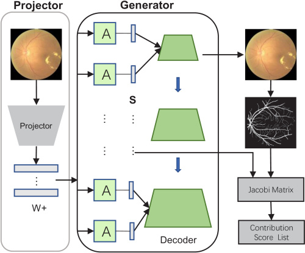
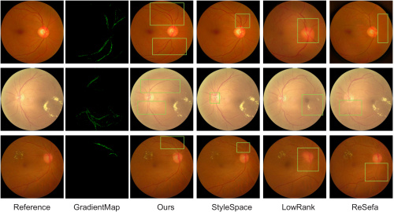
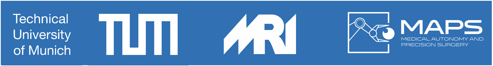

## Unobtrusive biometric data de-identification of fundus images using latent space disentanglement`</sub>`

This paper presents an image-specific de-identification method on the vascular structure of retinal fundus images to anonymize ophthalmic images while preserving important clinical features such as hard exudates. Our method calculates the contribution of latent code in latent space to the vascular structure by computing the gradient map of the generated image with respect to latent space and then by computing the overlap between the vascular mask and the gradient map. The proposed method is designed to specifically target and effectively manipulate the latent code with the highest contribution score in vascular structures. Extensive experimental results show that our proposed method is competitive with other state-of-the-art approaches in terms of identity similarity and lesion similarity, respectively. Additionally, our approach allows for a better balance between identity similarity and lesion similarity, thus ensuring optimal performance in a trade-off manner.

## Overview of Method



## Requirements

```bash
python=3.9
pip install torch==1.11.0+cu113 torchvision==0.12.0+cu113 torchaudio==0.11.0 --extra-index-url https://download.pytorch.org/whl/cu113
pip install -r requirements.txt
```

## Pre-trained models

You can download the pre-trained [stylegan model](https://drive.google.com/file/d/14-Sv793VyBrSD-xXefCMJ_WYgpXIkv35/view?usp=sharing) and [vessel-seg model](https://drive.google.com/file/d/1qXn_JvYr3bk10_PTUdonwUGvgb_OU87a/view?usp=sharing), then put them in 'weights' folder.

## Projector

You can project the image into latent codes by:

```
python projector.py --outdir=out --target=fundus.png --network=weights/network.pkl
```

## Run

```python
Run jupyter notebook in script floder
```

## Manipulation Results




